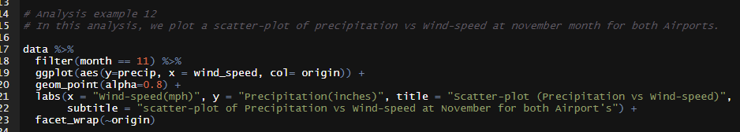
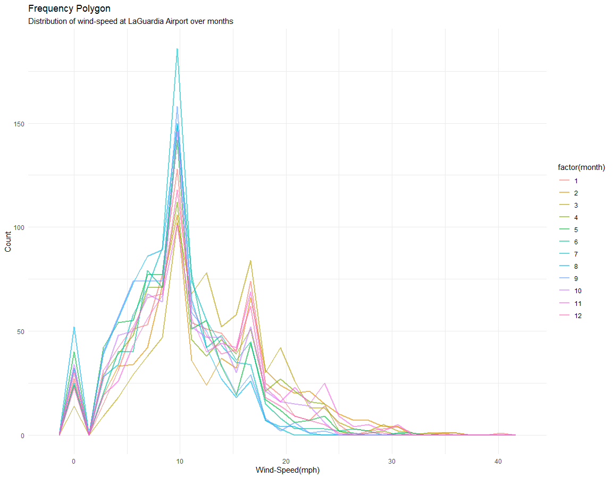

**Analysis and Results**
========================

**1 Preliminary preparation**
-----------------------------

**2 Analysis Example 1**
------------------------

From the above analysis, we can say dewpoint for both airports were
quite same. Also, the distribution of dewpoint is similar. Finally, we
can say the dewpoint is following approximately normal distribution for
both the airports.

**3 Analysis Example 2**
--------------------------------------------------------------------------------------------------------------------

For both the airports the highest wind-speed are recorded at month 2.
And we see similar inconsistent trend for both airports. For each month
we observe many outliers. And the boxplots for each month are
comparatively longer which indicates values are much scattered from
their median value.

**4 Analysis Example 3**
------------------------

From the above analysis, we see similar inconsistent trend for both
airports. At JFK airport we observe an outlier for month 6 and at LGA we
observe three outliers for month 11. And the boxplots for each month are
comparatively longer which indicates values are much scattered from
their median value.

**5 Analysis Example 4**
------------------------

We have shown a scatter-plot between dewpoint and pressure to figure out
if there is any inter-relationship between them. But the scatterplot
isn’t showing any obvious pattern and scattered all over area and hence
we can conclude there is no relationship between dewpoint and pressure.

**6 Analysis Example 5**
------------------------

From the above analysis, we are seeing the variation of dewpoint by
months for both airports. We can conclude dewpoint by months showing a
symmetrical shape and hence its following normal distribution. And this
conclusion is same for both the airports.

**7 Analysis Example 6**
------------------------

We have shown scatter-plot between temperature and dewpoint over
different months. And we can see an obvious pattern here for every
month. We see that, for every month as the dewpoint increases the
temperature also increases. Hence, there is a positive relationship
between temperature and dewpoint.

**8 Analysis Example 7**
------------------------

We plotted a density plot of wind-speed at month 8 (August) for both the
airports. For both the airports the distribution wind-speed is quite
similar. And both the density plot is positively right skewed

**9 Analysis Example 8**
------------------------

We plotted different density plots of pressure at LaGuardia Airport for
different months. And as we can observe, the distribution of pressure
doesn’t change that much by months, it is quite consistent for every
month. Hence, we can conclude the values of pressure is approximately
normally distributed for each month.

**10 Analysis Example 9**
-------------------------

We can observe a time-series plot of relative humidity over the year at
LaGuardia Airport. And the trendline is completely consistent over the
year but showing no obvious patterns.

**11 Analysis Example 10**
--------------------------

We can observe a time-series plot of wind-speed over the year at John F.
Kennedy International Airport. And the trendline is completely
consistent over the year but showing no obvious patterns. Though we can
comment on highest wind-speed which is seen to be occurred at month
February.

**12 Analysis Example 11**
--------------------------

The above bar-chart showing the variation of temperature over the months
for John F. Kennedy International Airport. We can conclude temperature
by months showing a symmetrical shape and hence we can say the values of
temperature over the months are normally distributed.

**13 Analysis Example 12**
--------------------------

Here, we plotted a scatterplot between precipitation and windspeed at
month November, to see if there’s any relationship between them. By
observing the scatter-plot we see no obvious pattern and so we can
conclude there is no relationship between amount of precipitation and
wind-speed.

**14 Analysis Example 13**
--------------------------

The above graph, we plotted frequency polygon of wind-speed for every
set of months to see if the distribution of wind-speed is similar for
each month. And yes, we can conclude the distribution of wind-speed is
similar for each month and it is positively right skewed.

**15 Analysis Example 14**
--------------------------

For both the airport we observe that, relative humidity is showing
similar frequency polygon. Though, the pattern isn’t so obvious but
similar for both the airports.
