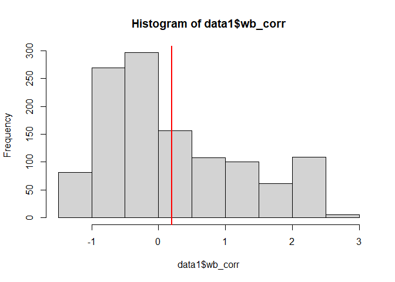
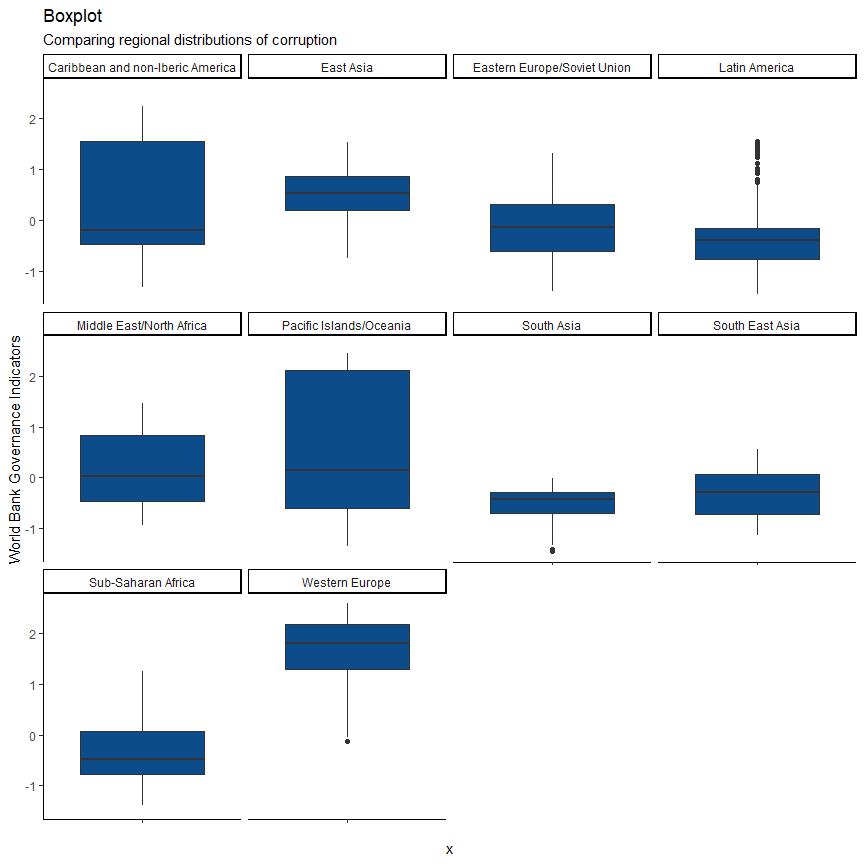
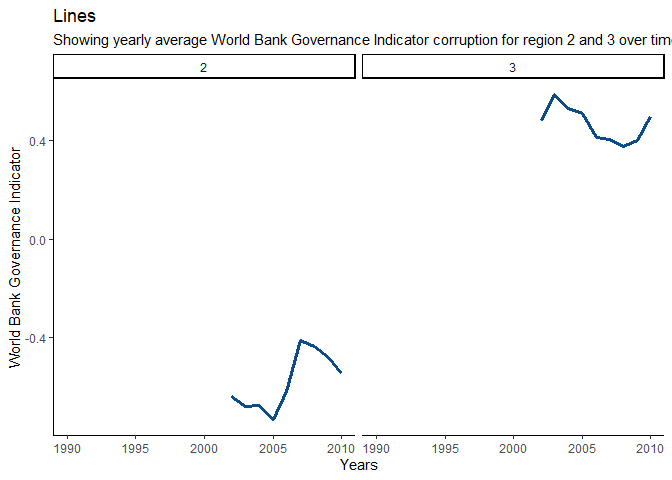
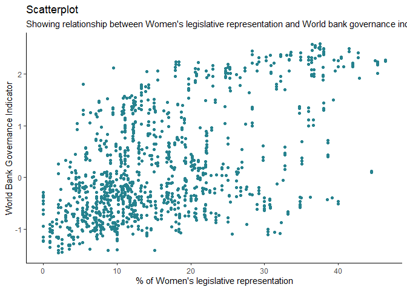
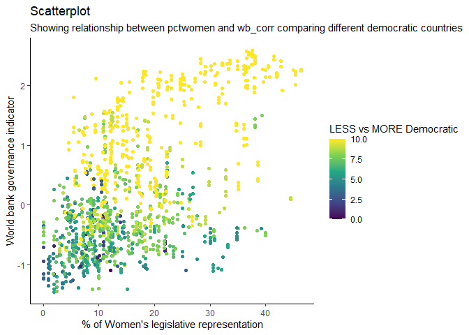
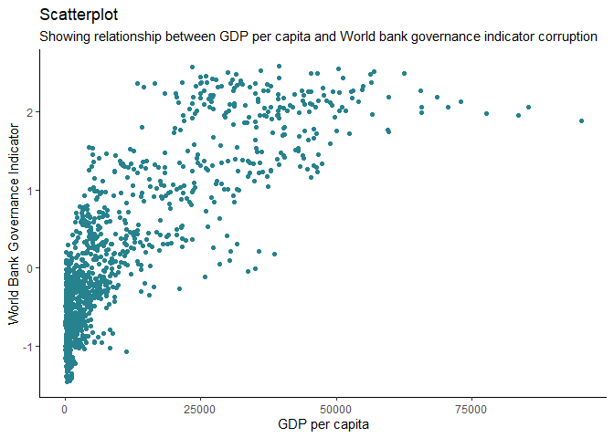
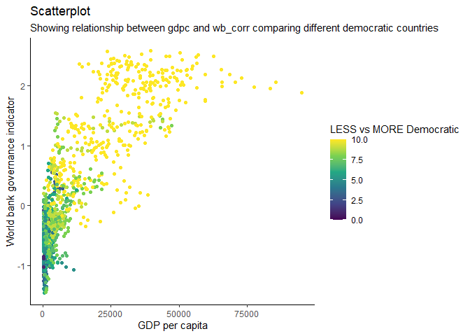

EDA and bivariate analysis of TSCS Corruptions Data
================

<style>
body {
text-align: justify}
</style>

## 1: Inspect the TSCS Corruption Dataset

### 1.A: R Code

``` r
#loading the package tidyverse
library(tidyverse) 

#importing the dataset
data1 <- read.csv("D:\\Projects\\EDA and Bivariate analysis of TSCS corruption data\\SchwindtBayer_Tavits_Data2016.csv") 

#finding the number of rows and observations in the dataset
nrow(data1)
```

    ## [1] 2002

``` r
#finding the number of columns and variables in the dataset
ncol(data1) 
```

    ## [1] 66

``` r
#inspecting first few rows/columns of data
head(data1) 
```

    ##   countryid aclp_code shcode country year pr cl  fh fh_neg polity2 democ2
    ## 1         1       143    216 Albania 1991  4  4 4.0   -4.0       1      1
    ## 2         1       143    216 Albania 1992  4  3 3.5   -3.5       5      1
    ## 3         1       143    216 Albania 1993  2  4 3.0   -3.0       5      1
    ## 4         1       143    216 Albania 1994  3  4 3.5   -3.5       5      1
    ## 5         1       143    216 Albania 1995  3  4 3.5   -3.5       5      1
    ## 6         1       143    216 Albania 1996  4  4 4.0   -4.0       0      1
    ##   exclude_new pres pres_new  wb_corr cpi_ti parties_ti_gcb officials_ti_gcb
    ## 1           0    0        0       NA     NA             NA               NA
    ## 2           0    0        0       NA     NA             NA               NA
    ## 3           0    0        0       NA     NA             NA               NA
    ## 4           0    0        0       NA     NA             NA               NA
    ## 5           0    0        0       NA     NA             NA               NA
    ## 6           0    0        0 -1.09444     NA             NA               NA
    ##   parl_ti_gcb abuse_bt policy_bt maj_govt_dpi maj_ajps_dpi pctwomen enpp
    ## 1          NA       NA        NA          100    100.00000      3.6 1.83
    ## 2          NA       NA        NA           60     80.00000      5.7 1.95
    ## 3          NA       NA        NA           60     73.33334      5.7 1.95
    ## 4          NA       NA        NA           60     70.00000      5.7 1.95
    ## 5          NA       NA        NA           60     68.00000     17.0 1.95
    ## 6          NA       NA        NA           60     66.66666     12.1 1.31
    ##   ethnic_frac press press2 press3     gdpc  log_gdp imports_pctgdp
    ## 1      0.2204    PF      2     53 346.0730 5.846650       27.59181
    ## 2      0.2204    PF      2     53 217.1583 5.380627       88.51225
    ## 3      0.2204    53      2     53 380.8089 5.942298       62.29255
    ## 4      0.2204    67      3     67 624.5351 6.437007       38.95032
    ## 5      0.2204    71      3     71 771.8625 6.648807       34.51205
    ## 6      0.2204    75      3     75 968.0720 6.875307       35.23079
    ##   exports_pctgdp      fdi pop_size trade_impexp trade_fdipop pct_protestant
    ## 1       7.224579       NA  3291695     34.81639           NA           0.23
    ## 2      11.490438 20000000  3266983    100.00269     6.121856           0.23
    ## 3      15.422523 58000000  3224901     77.71507    17.985048           0.23
    ## 4      11.351687 53000000  3179442     50.30201    16.669592           0.23
    ## 5      12.475374 70000000  3141102     46.98742    22.285173           0.23
    ## 6      12.316517 90100000  3112597     47.54730    28.946890           0.23
    ##   federal bicameral elecyear_lower elecsys_lower m_lower timing_lower
    ## 1       0        NA             NA            NA      NA           NA
    ## 2       0         0              1             3   40.00           NA
    ## 3       0         0              0             3   40.00           NA
    ## 4       0         0              0             3   40.00           NA
    ## 5       0         0              0             3   40.00           NA
    ## 6       0         0              1             3    1.21           NA
    ##   pers_lower upper_elecyear upper_ballot upper_vote upper_pool upper_avgm cohab
    ## 1         NA             NA           NA         NA         NA         NA     0
    ## 2         10             NA           NA         NA         NA         NA     0
    ## 3         10             NA           NA         NA         NA         NA     0
    ## 4         10             NA           NA         NA         NA         NA     0
    ## 5         10             NA           NA         NA         NA         NA     0
    ## 6         10             NA           NA         NA         NA         NA     0
    ##   pres_power quota_elec quota_reserved quota region region1 region2 region3
    ## 1         NA          0              0     0      9       0       0       0
    ## 2         NA          0              0     0      9       0       0       0
    ## 3         NA          0              0     0      9       0       0       0
    ## 4         NA          0              0     0      9       0       0       0
    ## 5         NA          0              0     0      9       0       0       0
    ## 6         NA          0              0     0      9       0       0       0
    ##   region4 region5 region6 region7 region8 region9 region10
    ## 1       0       0       0       0       0       1        0
    ## 2       0       0       0       0       0       1        0
    ## 3       0       0       0       0       0       1        0
    ## 4       0       0       0       0       0       1        0
    ## 5       0       0       0       0       0       1        0
    ## 6       0       0       0       0       0       1        0

``` r
#inspecting minimum year
min(data1$year) 
```

    ## [1] 1990

``` r
#inspecting maximum year
max(data1$year) 
```

    ## [1] 2010

``` r
#inspecting range of years
range(data1$year) 
```

    ## [1] 1990 2010

``` r
#inspecting the number of countries covered in the dataset using dplyr, piping operator etc.
data1 %>%
  select(country) %>%
  n_distinct() 
```

    ## [1] 115

### 1.B: Interpretation of the Findings

The dataset has 2002 rows/observations and 66 columns/variables. The
dataset is ranging from year 1990 to 2010. And, a total of 115 countries
covered in the dataset.

## 2: Summarize an Indicator of Corruption

### 2.A: R Code

``` r
#this is the World Bank Governance Indicator 
head(data1$wb_corr) 
```

    ## [1]       NA       NA       NA       NA       NA -1.09444

``` r
#calculating mean, median, minimum, maximum, and standard deviation of the corruption indicator
data1 %>%
  select(wb_corr) %>%
  summarise(Average = mean(wb_corr, na.rm = TRUE),
            Median = median(wb_corr, na.rm = TRUE),
            Minimum = min(wb_corr, na.rm = TRUE),
            Maximum = max(wb_corr, na.rm = TRUE),
            `Standard Deviation` = sd(wb_corr, na.rm = TRUE))
```

    ##     Average    Median Minimum  Maximum Standard Deviation
    ## 1 0.1987237 -0.128135 -1.4581 2.590772           1.028657

``` r
#plotting a histogram of the corruption indicator including a red colored line that showing the average of that variable.
hist(data1$wb_corr);abline(v = mean(data1$wb_corr, na.rm = TRUE), col= "red", lwd = 2) 
```

<!-- -->

### 2.B: Interpretation of the Results

The corruption indicator variable contains many missing values, so we
have to analyze/calculate summary statistics excluding those missing
values. The mean of variable is 0.198, median is -0.128, ranging from
-1.458 to 2.590 and the standard deviation is 1.02. The histogram
indicating to a right skewed distribution of the data.

## 3: Corruption Across Regions

### 3.A: R Code

``` r
#identifying the region variable
head(data1$region) 
```

    ## [1] 9 9 9 9 9 9

``` r
#using the dplyr package and piping operator, selecting the variable region and the using mutate and recode to recode the region variable numeric to character.
data1 <- data1 %>% 
  mutate(region_ch = recode(region, '1' = "Sub-Saharan Africa",
                                 '2' = "South Asia",
                                 '3' = "East Asia",
                                 '4' = "South East Asia",
                                 '5' = "Pacific Islands/Oceania",
                                 '6' = "Middle East/North Africa",
                                 '7' = "Latin America",
                                 '8' = "Caribbean and non-Iberic America",
                                 '9' = "Eastern Europe/Soviet Union",
                                 '10' = "Western Europe"))

#calculating the average of world bank governance indicator for every region
data1 %>% 
  group_by(region_ch) %>%
  summarize(mean(wb_corr, na.rm = TRUE))
```

    ## # A tibble: 10 x 2
    ##    region_ch                        `mean(wb_corr, na.rm = TRUE)`
    ##    <chr>                                                    <dbl>
    ##  1 Caribbean and non-Iberic America                         0.369
    ##  2 East Asia                                                0.460
    ##  3 Eastern Europe/Soviet Union                             -0.110
    ##  4 Latin America                                           -0.293
    ##  5 Middle East/North Africa                                 0.165
    ##  6 Pacific Islands/Oceania                                  0.696
    ##  7 South Asia                                              -0.552
    ##  8 South East Asia                                         -0.307
    ##  9 Sub-Saharan Africa                                      -0.345
    ## 10 Western Europe                                           1.66

``` r
#installing the package ggplot2 and the loading it. Plotting boxplots comparing the regional distributions of the corruption indicator. 
#install.packages("ggplot2")
ggplot(data1) +
 aes(x = "", y = wb_corr) +
 geom_boxplot(fill = "#0c4c8a") +
 labs(y = "World Bank Governance Indicators", title = "Boxplot", subtitle = "Comparing regional distributions of corruption") +
 theme_classic() +
 facet_wrap(vars(region_ch))
```

<!-- -->

### 3.B: Interpretation of the Results

There are 10 regions in this dataset. In these 10 regions, 5 regions
(1,2,4,7, and 9) are more corrupted than other 5 regions(3,5,6,8, and
10). The boxplot showing the distribution of corruption indicator for
each region, it also showing outliers and shape of the distribution.

## 4. Corruption Over Time

### 4.A: R Code

``` r
#calculating yearly average of world bank governance indicator for region 2 and 3.
data2 <- data1 %>%
  group_by(year, region) %>%
  filter(region == 2 | region == 3) %>%
  summarise(avg_yearly = mean(wb_corr, na.rm = TRUE))
data2
```

    ## # A tibble: 42 x 3
    ## # Groups:   year [21]
    ##     year region avg_yearly
    ##    <int>  <int>      <dbl>
    ##  1  1990      2        NaN
    ##  2  1990      3        NaN
    ##  3  1991      2        NaN
    ##  4  1991      3        NaN
    ##  5  1992      2        NaN
    ##  6  1992      3        NaN
    ##  7  1993      2        NaN
    ##  8  1993      3        NaN
    ##  9  1994      2        NaN
    ## 10  1994      3        NaN
    ## # ... with 32 more rows

``` r
#plotting yearly average of world bank governance indicator for region 2 and 3 over time (1990 to 2010). 
ggplot(data2) +
 aes(x = year, y = avg_yearly) +
 geom_line(size = 1.36, colour = "#0c4c8a") +
 labs(x = "Years", y = "World Bank Governance Indicator", title = "Lines", subtitle = "Showing yearly average World Bank Governance Indicator corruption for region 2 and 3 over time") +
 theme_classic() +
 facet_wrap(vars(region))
```

<!-- -->

### 4.B: Interpretation of the Results

For region 2, the corruption increased from 2002 to 2005 and then it
drastically decreased until 2007. And then again the corruption
increased slowly.  
For region 3, the corruption decreased from 2002 to 2003 and then it
slowly increased until 2008. And then again the corruption decreased
radically.

## 5: Women’s Political Empowerment and Corruption

### 5.A: R Code

``` r
#plotting a scatter-plot that will show the relationship between the variables.
ggplot(data1) +
 aes(y = wb_corr, x = pctwomen) +
 geom_point(size = 1.4, colour = "#26828e") +
 labs(y = "World Bank Governance Indicator", x = "% of Women's legislative representation", title = "Scatterplot", subtitle = "Showing relationship between Women's legislative representation and World bank governance indicator corruption") +
 theme_classic()
```

<!-- -->

``` r
#plotting a scatter-plot that will show the relationship between the variables comparing different democratic countries.
ggplot(data1) +
 aes(y = wb_corr, x = pctwomen , colour = polity2) +
 geom_point(size = 1.5) +
 scale_color_viridis_c(option = "viridis") +
 labs(y = "World bank governance indicator", x = "% of Women's legislative representation", title = "Scatterplot", subtitle = "Showing relationship between pctwomen and wb_corr comparing different democratic countries", color = "LESS vs MORE Democratic") +
 theme_classic()
```

<!-- -->

### 5.B: Interpretation of the Results

The first plot showing, as the percentage of women’s legislative
representation increases the corruption indicator also increases meaning
the corruption itself is decreasing.  
The second plot showing, percentage of women’s legislative
representation is more in democratic countries than less democratic
countries. Also, more democratic countries tends to have less corruption
because we can see higher value of corruption indicator which actually
means lesser corruption.

## 6: Bivariate Data Visualization of Corruption

### 6.A: R Code

``` r
#plotting a scatter-plot that will show the relationship between the variables.
ggplot(data1) +
 aes(y = wb_corr, x = gdpc) +
 geom_point(size = 1.4, colour = "#26828e") +
 labs(y = "World Bank Governance Indicator", x = "GDP per capita", title = "Scatterplot", subtitle = "Showing relationship between GDP per capita and World bank governance indicator corruption") +
 theme_classic()
```

<!-- -->

``` r
#plotting a scatter-plot that will show the relationship between the variables comparing different democratic countries.
ggplot(data1) +
 aes(y = wb_corr, x = gdpc, colour = polity2) +
 geom_point(size = 1.5) +
 scale_color_viridis_c(option = "viridis") +
 labs(y = "World bank governance indicator", x = "GDP per capita", title = "Scatterplot", subtitle = "Showing relationship between gdpc and wb_corr comparing different democratic countries", color = "LESS vs MORE Democratic") +
 theme_classic()
```

<!-- -->

### 6.B: Interpretation of the Results

The first plot showing, as the GDP per capita increases the corruption
indicator also increases meaning the corruption itself is decreasing.  
The second plot showing, the amount of GDP per capita is more in
democratic countries than less democratic countries. Also, more
democratic countries tends to have less corruption because we can see
higher value of corruption indicator which actually means lesser
corruption.
