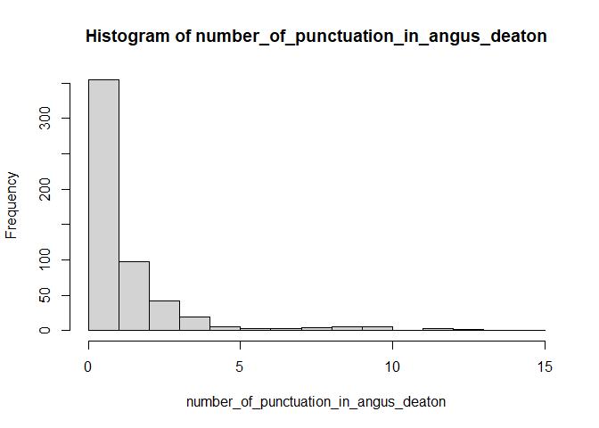
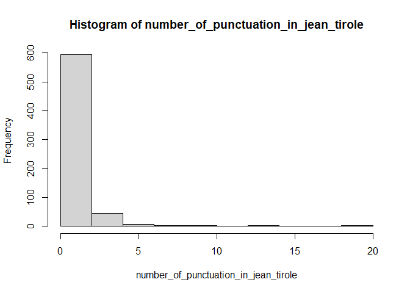
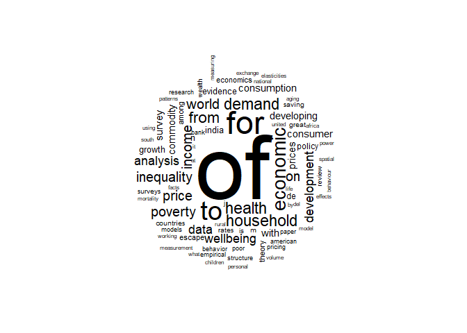
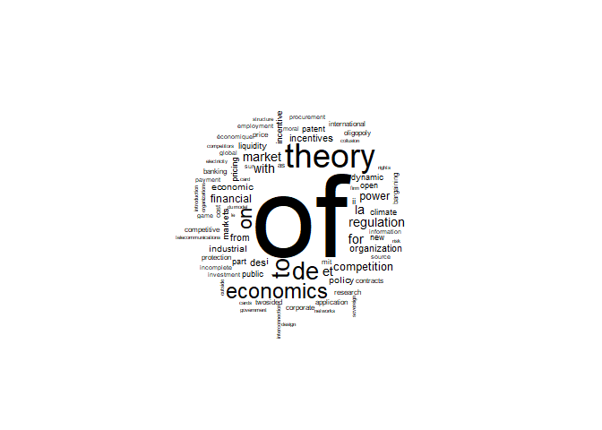
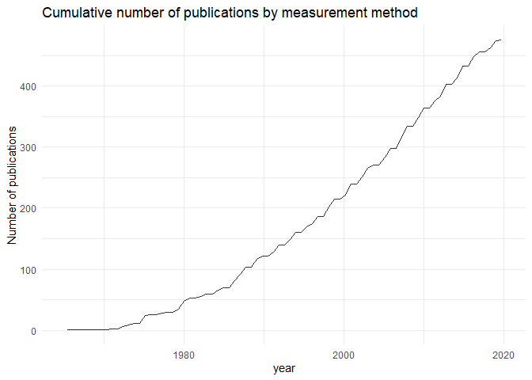
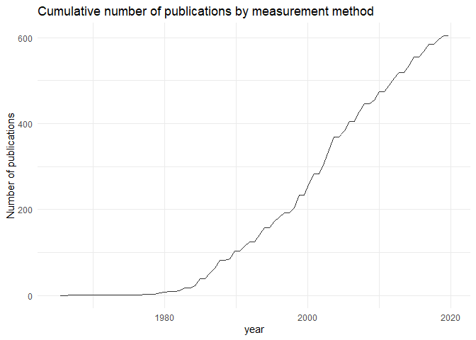

Web Scraping and Regex
================
03 June 2021

``` r
# Importing Data-sets
library(tidyverse)
library(stringr)
data1 <- read.csv("D:\\Projects\\Web scraping, Data Cleaning and REGEX\\data\\cleandata\\angus_deaton_GoogleScholarCitations.csv", stringsAsFactors = F)
data2 <- read.csv("D:\\Projects\\Web scraping, Data Cleaning and REGEX\\data\\cleandata\\jean_tirole_GoogleScholarCitations.csv", stringsAsFactors = F)
```

**Ques a) For the two scholars, how many of their paper titles begin
with a word that starts with a vowel, respectively?**

``` r
  length(which(grepl("^[aeiou]", tolower(data1$paperName))))
```

    ## [1] 146

``` r
  length(which(grepl("^[aeiou]", tolower(data2$paperName))))
```

    ## [1] 144

*Answer:* For scholar Angus Deaton, there are **146** paper titles begin
with a word that starts with a vowel,  
And for scholar Jean Tirole, there are **144** paper titles begin with a
word that starts with a vowel.

**Ques b) For the two scholars, how many of their paper titles end with
“s” respectively?**

``` r
length(which(grepl("[s]$", tolower(data1$paperName))))
```

    ## [1] 127

``` r
length(which(grepl("[s]$", tolower(data2$paperName))))
```

    ## [1] 231

*Answer:* For scholar Angus Deaton, there are **127** paper titles ends
with “s”,  
And for scholar Jean Tirole, there are **231** paper titles ends with
“s”.

**Ques c) For the two scholars, find the longest title, respectively
(“longest” in terms of number of characters).**

``` r
x <- data.frame(paperName=data1$paperName,chr=apply(data1,2,nchar)[,1])
which.max(x$chr)
```

    ## [1] 410

``` r
y <- data.frame(paperName=data2$paperName,chr=apply(data2,2,nchar)[,1])
which.max(y$chr)
```

    ## [1] 574

*Answer:* For scholar Angus Deaton, the longest title is at **410th**
row,  
And for scholar Jean Tirole, the longest title is at **574th** row.

**Ques d) For the two scholars, calculate the variable “number of
punctuation symbols in the their titles”. Display summary() statistics
of these variables, and the corresponding histograms..**

*Answer:*

``` r
number_of_punctuation_in_angus_deaton <- str_count(data1$paperName, "[[:punct:]]")
summary(number_of_punctuation_in_angus_deaton)
```

    ##    Min. 1st Qu.  Median    Mean 3rd Qu.    Max. 
    ##   0.000   0.000   1.000   1.523   2.000  15.000

``` r
hist(number_of_punctuation_in_angus_deaton)
```



``` r
number_of_punctuation_in_jean_tirole <- str_count(data2$paperName, "[[:punct:]]")
summary(number_of_punctuation_in_jean_tirole)
```

    ##    Min. 1st Qu.  Median    Mean 3rd Qu.    Max. 
    ##   0.000   0.000   1.000   1.087   1.000  20.000

``` r
hist(number_of_punctuation_in_jean_tirole)
```



**Ques e) Remove stop words(“the”, “a”, “an”, “and”, “in”, “if”, “but”),
numbers and punctuations from the titles**

*Answer:* The removal of stop words, numbers and punctuations are given
below-

``` r
library(tm)
paperName <- data1$paperName
paperName = paste(paperName, collapse = ",")
paperName = tolower(paperName)
paperName <- removeWords(paperName, c("the", "a", "an", "and", "in", "if", "but"))

paperName <- gsub("[[:digit:]]","", paperName)
paperName <- gsub("[[:punct:]]","", paperName)


paperName2 <- data2$paperName
paperName2 = paste(paperName2, collapse = ",")
paperName2 = tolower(paperName2)
paperName2 <- removeWords(paperName2, c("the", "a", "an", "and", "in", "if", "but"))
paperName2 <- gsub("[[:digit:]]","", paperName2)
paperName2 <- gsub("[[:punct:]]","", paperName2)
```

**Ques f) Excluding stop words, numbers and punctuations, what are the
10 most frequent words in scholar A’s titles?**

``` r
paperName = str_replace_all(paperName, pattern = "\\s+", " ")
all_titles_list1 = str_split(paperName, pattern = " ")
title_words1 = unlist(all_titles_list1)
unique_words1 = unique(title_words1)
num_unique_words1 = length(unique(title_words1))
count_words1 = rep(0, num_unique_words1)
for (i in 1:num_unique_words1) {
count_words1[i] = sum(title_words1 == unique_words1[i])
}
top_10_order1 = order(count_words1, decreasing = TRUE)[1:10]
top_10_words1 = unique_words1[top_10_order1]
top_10_words1
```

    ##  [1] "of"         "for"        "to"         "economic"   "household" 
    ##  [6] "demand"     "health"     "from"       "income"     "inequality"

*Answer:* Hence, the 10 most frequent words in Angus Deaton’s paper
titles are given above.

**Ques g) Excluding stop words, numbers and punctuations, what are the
10 most frequent words in scholar B’s titles?**

``` r
paperName2 = str_replace_all(paperName2, pattern = "\\s+", " ")
all_titles_list2 = str_split(paperName2, pattern = " ")
title_words2 = unlist(all_titles_list2)
unique_words2 = unique(title_words2)
num_unique_words2 = length(unique(title_words2))
count_words2 = rep(0, num_unique_words2)
for (i in 1:num_unique_words2) {
count_words2[i] = sum(title_words2 == unique_words2[i])
}
top_10_order2 = order(count_words2, decreasing = TRUE)[1:10]
top_10_words2 = unique_words2[top_10_order2]
top_10_words2
```

    ##  [1] "of"         "theory"     "to"         "de"         "economics" 
    ##  [6] "on"         "et"         "for"        "regulation" "market"

*Answer:* Hence, the 10 most frequent words in Jean Tirole’s paper
titles are given above.

**Data Visualization: Wordcloud**

**Ques 1. Excluding stop words, numbers and punctuations, create two
wordclouds for all thetitles of scholar A and B respectively. What’s
your observation from the wordcloud plots?**

*Answer:* We observe from both plots that, most frequent words are
**bold and bigger** than others.

``` r
library(wordcloud)
scholar_angus_deaton <- wordcloud(unique_words1, count_words1, scale=c(8,.2), min.freq=6,
max.words=Inf, random.order=FALSE, rot.per=.15)
```



``` r
scholar_jean_tirole <- wordcloud(unique_words2, count_words2, scale=c(8,.2), min.freq=6,
max.words=Inf, random.order=FALSE, rot.per=.15)
```



**Ques 2. Create a line plot that displays the number of the
publications for the two scholars across years. What can you observe
from the plot?**

*Answer:* The plots are given below-

``` r
ggplot(data=data1, aes(x=year)) +
  stat_bin(bins=80, aes(y=cumsum(..count..)), geom="line", alpha=0.8) +
  ylab("Number of publications") + xlim(1965,2020) + ggtitle("Cumulative number of publications by measurement method")+
  theme_minimal()
```



``` r
ggplot(data=data2, aes(x=year)) +
  stat_bin(bins=80, aes(y=cumsum(..count..)), geom="line", alpha=0.8) +
  ylab("Number of publications") + xlim(1965,2020) + ggtitle("Cumulative number of publications by measurement method")+
  theme_minimal()
```



**Final Part: Report**

**Q1. On average, which scholar has more co-authors?**

``` r
researcher1 <- data1$researcher

mean(str_count(researcher1, ",")) #average co-authors of Angus Deaton
```

    ## [1] 1.385321

``` r
researcher2 <- data2$researcher

mean(str_count(researcher2, ",")) #average co-authors of Jean Tirole
```

    ## [1] 1.240122

*Answer:* Hence, on average scholar **Angus Deaton** has more
co-authors.

**Q2. Do the two scholars have mutual friends(co-authors)? If yes, print
the names of their friends.**

*Answer:* Yes, both the scholars have mutual friends, the names of their
friends are generated below-

``` r
coauthors1 = sapply(as.character(researcher1), strsplit, ", ")
coauthors1 = lapply(coauthors1, trimws)
coauthors.unique1 = unique(unlist(coauthors1))[order(unique(unlist(coauthors1)))]
coauthors.unique1 = coauthors.unique1[-c(1,2)]
print(coauthors.unique1)
```

    ##   [1] "A Alesina"             "A Alstott"             "A AND"                
    ##   [4] "A Ando"                "A Assiter"             "A Banerjee"           
    ##   [7] "A Barten"              "A Bebbington"          "A Bhaduri"            
    ##  [10] "A Bosh-Domenech"       "A Bottomley"           "A Braverman"          
    ##  [13] "A Brown"               "A Case"                "A Chanda"             
    ##  [16] "A de Palma"            "A Deaton"              "A DEATON"             
    ##  [19] "A Feizi"               "A FRANKEL"             "A Friedlaender"       
    ##  [22] "A Heston"              "A HESTON"              "A Income"             
    ##  [25] "A Kazemnejad"          "A Krueger"             "A Laroque"            
    ##  [28] "A Lleras-Muney"        "A Lopez-Claros"        "A Mas-Colell"         
    ##  [31] "A Mason"               "A Michael"             "A Michaelides"        
    ##  [34] "A que valen un Premio" "A Revenga"             "A Roulet"             
    ##  [37] "A SCHLOSSER"           "A Steptoe"             "A Stone"              
    ##  [40] "A Tarozzi"             "A Zezza"               "AA Stone"             
    ##  [43] "AB Atkinson"           "AC Case"               "AC Goodman"           
    ##  [46] "AD Abernethy"          "AE CLARK"              "African Union"        
    ##  [49] "AJ Auerbach"           "AJ Krupnick"           "AK Dixit"             
    ##  [52] "AK Kashyap"            "AM Aizcorbe"           "AM Al-Shuaibi"        
    ##  [55] "AM Garber"             "AP Blostin"            "APE Cooperation"      
    ##  [58] "AQA Amin"              "AS Blinder"            "AS Deaton"            
    ##  [61] "AS DEATON"             "AS McLeod"             "AV Banerjee"          
    ##  [64] "B ABRAHAM"             "B Ackerman"            "B Agarwal"            
    ##  [67] "B Andía-Pérez"         "B Ascher"              "B Aten"               
    ##  [70] "B BACON"               "B Balassa"             "B Balk"               
    ##  [73] "B Bosworth"            "B Croxson"             "B Davies"             
    ##  [76] "B Dhehibi"             "B Eichengreen"         "B Mundial"            
    ##  [79] "B MUNDIAL"             "B Price"               "B SZENTES"            
    ##  [82] "BB Mohanty"            "BC Fred"               "BD Bernheim"          
    ##  [85] "BH Hall"               "BY Aw"                 "C Ai"                 
    ##  [88] "C ANSLEY"              "C Arndt"               "C Azzi"               
    ##  [91] "C Balassa"             "C Bozzoli"             "C Eckel"              
    ##  [94] "C Grootaert"           "C Meghir"              "C Milana"             
    ##  [97] "C Myers"               "C Paxson"              "C Quintana-Domeque"   
    ## [100] "C Udry"                "C Winston"             "C Yates"              
    ## [103] "CF Ansley"             "CG Victora"            "CH Paxson"            
    ## [106] "CL Ballard"            "CM Bustamante"         "CT Hsieh"             
    ## [109] "CT Morris"             "D Acemoglu"            "D Angus"              
    ## [112] "D Autor"               "D Barnett"             "D Benjamin"           
    ## [115] "D Blau"                "D Coffey"              "D Cutler"             
    ## [118] "D Donaldson"           "D Doring"              "D Dorn"               
    ## [121] "D Dranove"             "D Duffle"              "D Fudenberg"          
    ## [124] "D Fullerton"           "D Halpern"             "D Kahneman"           
    ## [127] "D Kreps"               "D Lubotsky"            "D Massey"             
    ## [130] "D Rodrik"              "D Sandri"              "D SERGEYEV"           
    ## [133] "D Sgroi"               "D Spears"              "D Thomas"             
    ## [136] "DA Belsley"            "DA Wise"               "DG Tarr"              
    ## [139] "DM BERNHOFEN"          "DM Betson"             "DM Cutler"            
    ## [142] "DR Holden"             "DS Ball"               "DW Adams"             
    ## [145] "DW Jorgenson"          "E Ahonzo"              "E Andrews"            
    ## [148] "E Cannon"              "E Diener"              "E DIEWERT"            
    ## [151] "E Duflo"               "E Durbin"              "E Glaeser"            
    ## [154] "E Hall"                "E Hoffman"             "E Hsu"                
    ## [157] "E Ligon"               "E Nakamura"            "E Prasad"             
    ## [160] "E Saez"                "E Valenzuela"          "E Werker"             
    ## [163] "EA García"             "EA Haddad"             "EJ Balistreri"        
    ## [166] "EK Antwi"              "EL Glaeser"            "EO ANANAT"            
    ## [169] "ER Berndt"             "EV Edmonds"            "EZ Elhawary"          
    ## [172] "F Ahmed"               "F BOURGUIGNON"         "F Breuss"             
    ## [175] "F COLLARD"             "F Grimard"             "F Hayashi"            
    ## [178] "F Ramade"              "FA Akala"              "FHC Crick"            
    ## [181] "FR Games"              "FZ Ahmed"              "G Akerlof"            
    ## [184] "G Aneuryn-Evans"       "G Auten"               "G Babaee"             
    ## [187] "G Becker"              "G Bel"                 "G Brown"              
    ## [190] "G Burtless"            "G Calvo"               "G Carletto"           
    ## [193] "G Chamberlain"         "G Dan"                 "G Debreu"             
    ## [196] "G KAPLAN"              "G King"                "G Laroque"            
    ## [199] "G O’Donnell"           "G Solon"               "GD Hess"              
    ## [202] "GH Hanson"             "GM Alam"               "GP Cipriani"          
    ## [205] "GS Becker"             "GZ Jin"                "H Aaron"              
    ## [208] "H AKAIKE"              "H Chenery"             "H David"              
    ## [211] "H DELLAS"              "H Pack"                "H Sengul"             
    ## [214] "HG Frankfurt"          "HJ Aaron"              "HT Chang"             
    ## [217] "I Adelman"             "I Almas"               "I Bertilsson"         
    ## [220] "I Morris"              "IA Gomez"              "IM Mbiti"             
    ## [223] "IWH Parry"             "J Adamy"               "J Altmann"            
    ## [226] "J Ameriks"             "J Artus"               "J Austen"             
    ## [229] "J Bhagwati"            "J Bindman"             "J Bolt"               
    ## [232] "J Brooks-Gunn"         "J Campbell"            "J Chipman"            
    ## [235] "J Chou"                "J Covey"               "J Cullis"             
    ## [238] "J Currie"              "J Davies"              "J Davis"              
    ## [241] "J Dreze"               "J Drèze"               "J Dupre"              
    ## [244] "J Eaton"               "J EATON"               "J Fortson"            
    ## [247] "J Friedman"            "J Gokhale"             "J Herrin"             
    ## [250] "J Lanjouw"             "J Muellbauer"          "J Neelin"             
    ## [253] "J Osterhammel"         "J Powers"              "J Roemer"             
    ## [256] "J Ruiz-Castillo"       "J SHOVEN"              "J Sulaiman"           
    ## [259] "J van der Gaag"        "JA Bell"               "JA Parker"            
    ## [262] "JB Donaldson"          "JB Liebman"            "JC Aker"              
    ## [265] "JC Beresford"          "JC Brada"              "JC BROWN"             
    ## [268] "JC Buchan"             "JD Angrist"            "JD Watson"            
    ## [271] "JE Aldy"               "JE Anderson"           "JE Broderick"         
    ## [274] "JE Cairnes"            "JE Duggan"             "JE Schwartz"          
    ## [277] "JE Stiglitz"           "JE Taylor"             "JH Abbring"           
    ## [280] "JJ Heckman"            "JJ Sabia"              "JJ Siegfried"         
    ## [283] "JJ SIEGFRIED"          "JL Coronado"           "JM BRUNDY"            
    ## [286] "JM Gil"                "JÓN STEINSSON"         "JP BENOIT"            
    ## [289] "JP CARPER"             "JP COTIS"              "JR Artus"             
    ## [292] "JS Pischke"            "JT Abaluck"            "JW Brock"             
    ## [295] "K Anderson"            "K Arrow"               "K Basu"               
    ## [298] "K Beron"               "K Chung"               "K Dervis"             
    ## [301] "K DERVIS"              "K Graber"              "K Hoff"               
    ## [304] "K Pickett"             "K Rogoff"              "K WIGLEY"             
    ## [307] "KB Anderson"           "KG Abraham"            "KH Anderson"          
    ## [310] "KJ Rothman"            "KJ Wigley"             "KS Parikh"            
    ## [313] "L Ahnstrom"            "L Alfaro"              "L Ball"               
    ## [316] "L Brainard"            "L De"                  "L Demery"             
    ## [319] "L Hansen"              "L Peccati"             "L Seidlitz"           
    ## [322] "L Summers"             "LC Baker"              "LD Bobo"              
    ## [325] "LG Epstein"            "LP Hansen"             "M Abbott"             
    ## [328] "M Abdel-Fadil"         "M Aglietta"            "M AGLIETTA"           
    ## [331] "M Ahmed"               "M Ainsworth"           "M Alierta"            
    ## [334] "M Allais"              "M Aoki"                "M Archer"             
    ## [337] "M Artis"               "M Ashmore"             "M Bailey"             
    ## [340] "M Bale"                "M Baranzini"           "M Barrow"             
    ## [343] "M Bronkers"            "M Browning"            "M BRowNIrc"           
    ## [346] "M Calì"                "M Durand"              "M Dutta"              
    ## [349] "M FLEURBAEY"           "M Grosh"               "M GROSH"              
    ## [352] "M Hotopf"              "M Irish"               "M Kurzweil"           
    ## [355] "M Lamont"              "M LEVY"                "M RAVALLION"          
    ## [358] "M Rosenzweig"          "M Ruel"                "M Schreiner"          
    ## [361] "M Sherraden"           "M Stano"               "M Syrquin"            
    ## [364] "MA Aksoy"              "MA Erbetta"            "MA Kose"              
    ## [367] "MC Center"             "MC Inhorn"             "MC Rousu"             
    ## [370] "MD Intriligator"       "ME BOCK"               "ME Grosh"             
    ## [373] "ME Porter"             "MG Dastidar"           "MG Duggan"            
    ## [376] "MH Pesaran"            "MI Jackson"            "MJ Alhabeeb"          
    ## [379] "MJ BROWNING"           "MLV Maggio"            "MM Pitt"              
    ## [382] "MM Sector"             "MN Azam"               "MR Rosenzweig"        
    ## [385] "MS Ahluwalia"          "MS Feldstein"          "MS FELDSTEIN"         
    ## [388] "N Atoda"               "N Bhattacharya"        "N Bos"                
    ## [391] "N Cartwright"          "N Glozier"             "N Lustig"             
    ## [394] "N Stern"               "N STERN"               "NFR Crafts"           
    ## [397] "O Ashenfelter"         "O ÅSLUND"              "O Dupriez"            
    ## [400] "P Abrams"              "P Aghion"              "P Allen"              
    ## [403] "P Anderson"            "P Arestis"             "P Bardhan"            
    ## [406] "P Belin"               "P Bod"                 "P Collier"            
    ## [409] "P Dasgupta"            "P Doeringer"           "P Donaldson"          
    ## [412] "P Farmer"              "P Fine"                "P Gertler"            
    ## [415] "P Glewwe"              "P Guidotti"            "P Moran"              
    ## [418] "P Simmons"             "P Streeten"            "P Winters"            
    ## [421] "P Zong"                "PA Diamond"            "PA Yotopoulos"        
    ## [424] "PAC Browning"          "PB Bach"               "PB Dixon"             
    ## [427] "PD Adams"              "PERA EDIN"             "PJ Allender"          
    ## [430] "PJ Gertler"            "PO Gourinchas"         "PS Armington"         
    ## [433] "PS Moore"              "R Aaberge"             "R Agnew"              
    ## [436] "R Anand"               "R ANDERSON"            "R Arora"              
    ## [439] "R Bahl"                "R Ball"                "R Barro"              
    ## [442] "R Blundell"            "R Chambers"            "R Chattopadhyay"      
    ## [445] "R Cookson"             "R Feenstra"            "R Fogel"              
    ## [448] "R Gouma"               "R Guesnerie"           "R Hanna"              
    ## [451] "R Layard"              "R Lee"                 "R Portes"             
    ## [454] "R Sieburth"            "R Stewart"             "R Summers"            
    ## [457] "R Tortora"             "R Undurraga"           "RE Baldwin"           
    ## [460] "RE Caves"              "RE Evenson"            "RE Hall"              
    ## [463] "RE Lucas"              "RG Hubbard"            "RG Newell"            
    ## [466] "RI Miller"             "RJ Barro"              "RM Blank"             
    ## [469] "RM McCleary"           "RT Michael"            "S Abdelhak"           
    ## [472] "S Acharya"             "S Adams"               "S Agha"               
    ## [475] "S Alberts"             "S ALKIRE"              "S Chen"               
    ## [478] "S Cole"                "S Collins"             "S Dimeli"             
    ## [481] "S El-Saharty"          "S Folland"             "S Galiani"            
    ## [484] "S Johnson"             "S Khan"                "S Laird"              
    ## [487] "S Mohd"                "S Ng"                  "S Oishi"              
    ## [490] "S Robinson"            "S Schneider"           "S Subramanian"        
    ## [493] "S van Wijnbergen"      "S Welfare"             "S Yusuf"              
    ## [496] "S Zaidi"               "SC Chiang"             "SG Reddy"             
    ## [499] "SJ Wei"                "SNH Naqvi"             "T Amemiya"            
    ## [502] "T Basar"               "T Bergstrom"           "T Chatfield"          
    ## [505] "T Ford"                "T Glass"               "T Ito"                
    ## [508] "T Miller"              "T Ozuna Jr"            "TA Abbott"            
    ## [511] "TA Sussangkarn"        "TN Srinivasan"         "TP Schultz"           
    ## [514] "TS Barker"             "TW Anderson"           "U Akcigit"            
    ## [517] "V Alatas"              "V Curtis"              "V Hajivassiliou"      
    ## [520] "V Khanna"              "V Kozel"               "V LAVY"               
    ## [523] "VAY KRIssNA"           "VG Panwalkar"          "VH Woodward"          
    ## [526] "VK CHETTV"             "W Adams"               "W Adriaansen"         
    ## [529] "W Easterly"            "W Enders"              "W Lee"                
    ## [532] "W Martin"              "W McGreevey"           "WA Pizer"             
    ## [535] "WM Adams"              "WR Avison"             "WR Keech"             
    ## [538] "WTD Acemoglu"          "X Amemiya"             "X del Carpio"         
    ## [541] "Y Alagh"               "Y Benjamini"           "Y Chang"              
    ## [544] "Z Griliches"           "ZJ Acs"

``` r
coauthors2 = sapply(as.character(researcher2), strsplit, ", ")
coauthors2 = lapply(coauthors2, trimws)
coauthors.unique2 = unique(unlist(coauthors2))[order(unique(unlist(coauthors2)))]
coauthors.unique2 = coauthors.unique2[-c(1,2,3,4)]
print(coauthors.unique2)
```

    ##   [1] "A Agassi"                                                                      
    ##   [2] "A Akhiezer"                                                                    
    ##   [3] "A Benassy-Quéré"                                                               
    ##   [4] "A Bénassy-Quéré"                                                               
    ##   [5] "A Bhide"                                                                       
    ##   [6] "A Bogomolnaia"                                                                 
    ##   [7] "A Bozio"                                                                       
    ##   [8] "A Brender"                                                                     
    ##   [9] "A Demand"                                                                      
    ##  [10] "A Dills"                                                                       
    ##  [11] "A Falk"                                                                        
    ##  [12] "A Goldfarb"                                                                    
    ##  [13] "A Kalhan"                                                                      
    ##  [14] "A Klein"                                                                       
    ##  [15] "A Landier"                                                                     
    ##  [16] "A Macfarlane"                                                                  
    ##  [17] "A Ockenfels"                                                                   
    ##  [18] "A Oleinik"                                                                     
    ##  [19] "A Saunders"                                                                    
    ##  [20] "A Schwartz"                                                                    
    ##  [21] "A Zylberberg"                                                                  
    ##  [22] "AA Alchian"                                                                    
    ##  [23] "AA Rampini"                                                                    
    ##  [24] "AD Zucker"                                                                     
    ##  [25] "AK Agrawal"                                                                    
    ##  [26] "AL Eisfeldt"                                                                   
    ##  [27] "AP Semenov"                                                                    
    ##  [28] "AW Bartik"                                                                     
    ##  [29] "B Caillaud"                                                                    
    ##  [30] "B Chiao"                                                                       
    ##  [31] "B Czarniawska"                                                                 
    ##  [32] "B Dormont"                                                                     
    ##  [33] "B Eckwert"                                                                     
    ##  [34] "B ÉGERT"                                                                       
    ##  [35] "B Fulda"                                                                       
    ##  [36] "B Holmstrm"                                                                    
    ##  [37] "B Holmstro¨m"                                                                  
    ##  [38] "B Holmstrom"                                                                   
    ##  [39] "B HOLMSTROM"                                                                   
    ##  [40] "B Holmström"                                                                   
    ##  [41] "B Jullien"                                                                     
    ##  [42] "B Nalebuff"                                                                    
    ##  [43] "BÃ Roland"                                                                     
    ##  [44] "BH Hall"                                                                       
    ##  [45] "BR Holmstrom"                                                                  
    ##  [46] "BYJJ Larrom"                                                                   
    ##  [47] "C Catalini"                                                                    
    ##  [48] "C Chamley"                                                                     
    ##  [49] "C Gollier"                                                                     
    ##  [50] "C Governance"                                                                  
    ##  [51] "C Henry"                                                                       
    ##  [52] "C Schultz"                                                                     
    ##  [53] "C Tian"                                                                        
    ##  [54] "C Wolfram"                                                                     
    ##  [55] "C Young"                                                                       
    ##  [56] "CD Aliprantis"                                                                 
    ##  [57] "CL Arnold"                                                                     
    ##  [58] "CM Baily"                                                                      
    ##  [59] "D Acemoglu"                                                                    
    ##  [60] "D Acemogul"                                                                    
    ##  [61] "D Cogneau"                                                                     
    ##  [62] "D Del Boca"                                                                    
    ##  [63] "D Fudenberg"                                                                   
    ##  [64] "D FUDENBERG"                                                                   
    ##  [65] "D Fundenberg"                                                                  
    ##  [66] "D GROMB"                                                                       
    ##  [67] "D Hackbarth"                                                                   
    ##  [68] "D Levine"                                                                      
    ##  [69] "D Mandy"                                                                       
    ##  [70] "D Martimort"                                                                   
    ##  [71] "D MIHALJEK"                                                                    
    ##  [72] "D Mookherjee"                                                                  
    ##  [73] "D Nachman"                                                                     
    ##  [74] "D Newbery"                                                                     
    ##  [75] "D Pérez-Castrillo"                                                             
    ##  [76] "D Puga"                                                                        
    ##  [77] "D Shaviro"                                                                     
    ##  [78] "D Thesmar"                                                                     
    ##  [79] "DA Baker"                                                                      
    ##  [80] "DB Audretsch"                                                                  
    ##  [81] "DH Jin"                                                                        
    ##  [82] "DJC MacKay"                                                                    
    ##  [83] "DK Levine"                                                                     
    ##  [84] "DM Kreps"                                                                      
    ##  [85] "DM Weiss"                                                                      
    ##  [86] "DS Jeon"                                                                       
    ##  [87] "DW Carlton"                                                                    
    ##  [88] "E Farhi"                                                                       
    ##  [89] "E Fehr"                                                                        
    ##  [90] "E KOCENDA"                                                                     
    ##  [91] "É Laurent"                                                                     
    ##  [92] "E Macchiavello"                                                                
    ##  [93] "E Maskin"                                                                      
    ##  [94] "E Peyrache"                                                                    
    ##  [95] "E Saez"                                                                        
    ##  [96] "E Tironi"                                                                      
    ##  [97] "E Turpin"                                                                      
    ##  [98] "É Wasmer"                                                                      
    ##  [99] "EG Weyl"                                                                       
    ## [100] "ES Maskin"                                                                     
    ## [101] "ES Phelps"                                                                     
    ## [102] "F Benhamou"                                                                    
    ## [103] "F Bourguignon"                                                                 
    ## [104] "F Canova"                                                                      
    ## [105] "F INTERMEDIATION"                                                              
    ## [106] "F Lippi"                                                                       
    ## [107] "F PANUNZI"                                                                     
    ## [108] "F van der Ploeg"                                                               
    ## [109] "F Zumer"                                                                       
    ## [110] "FN Blanchard"                                                                  
    ## [111] "France. Conseil d'analyse économique"                                          
    ## [112] "France. Conseil d'analyse économique (CAE)"                                    
    ## [113] "G Ailon"                                                                       
    ## [114] "G Ainslie"                                                                     
    ## [115] "G Akerlof"                                                                     
    ## [116] "G Bolton"                                                                      
    ## [117] "G Dell'Ariccia"                                                                
    ## [118] "G Gorton"                                                                      
    ## [119] "G Idei"                                                                        
    ## [120] "G IDEI"                                                                        
    ## [121] "G Knieps"                                                                      
    ## [122] "G Mailath"                                                                     
    ## [123] "G Martini"                                                                     
    ## [124] "G Ordonez"                                                                     
    ## [125] "G Plantin"                                                                     
    ## [126] "G Qiuping"                                                                     
    ## [127] "G Weyl"                                                                        
    ## [128] "GA Akerlof"                                                                    
    ## [129] "GC d’Aspremont"                                                                
    ## [130] "GK Leonard"                                                                    
    ## [131] "H Bourguignon"                                                                 
    ## [132] "H Boussouf-Idrissi"                                                            
    ## [133] "H Gersbach"                                                                    
    ## [134] "H Mehran"                                                                      
    ## [135] "H Tabakovic"                                                                   
    ## [136] "HE Bolton"                                                                     
    ## [137] "HL Rosenthal"                                                                  
    ## [138] "HR Varian"                                                                     
    ## [139] "I Geras"                                                                       
    ## [140] "I Gremaq"                                                                      
    ## [141] "I Grosfeld"                                                                    
    ## [142] "I Hasan"                                                                       
    ## [143] "I Jewitt"                                                                      
    ## [144] "I Macho-Stadler"                                                               
    ## [145] "I Parry"                                                                       
    ## [146] "I Vogelsang"                                                                   
    ## [147] "IAN JEWITT"                                                                    
    ## [148] "J Arlen"                                                                       
    ## [149] "J Beccherle"                                                                   
    ## [150] "J Cailloux"                                                                    
    ## [151] "J Cremer"                                                                      
    ## [152] "J Davila"                                                                      
    ## [153] "J Delpla"                                                                      
    ## [154] "J Design"                                                                      
    ## [155] "J Handmer"                                                                     
    ## [156] "J Heaton"                                                                      
    ## [157] "J Laffont"                                                                     
    ## [158] "J Leitzel"                                                                     
    ## [159] "J Lemer"                                                                       
    ## [160] "J Lerner"                                                                      
    ## [161] "J Massó Carreras"                                                              
    ## [162] "J McLure"                                                                      
    ## [163] "J Mistral"                                                                     
    ## [164] "J Rileyt"                                                                      
    ## [165] "J Stiglitz"                                                                    
    ## [166] "J Taylor"                                                                      
    ## [167] "J Tirole"                                                                      
    ## [168] "J TIROLE"                                                                      
    ## [169] "J Tiróle"                                                                      
    ## [170] "J TlROLE"                                                                      
    ## [171] "J Triole"                                                                      
    ## [172] "J Watson"                                                                      
    ## [173] "J Yellen"                                                                      
    ## [174] "JA Hausman"                                                                    
    ## [175] "JA Miron"                                                                      
    ## [176] "JA Mirrlees"                                                                   
    ## [177] "JA Tirole"                                                                     
    ## [178] "JC Agnew"                                                                      
    ## [179] "JC Rochet"                                                                     
    ## [180] "JC ROCHET"                                                                     
    ## [181] "JE Stiglitz"                                                                   
    ## [182] "JJ Laffont"                                                                    
    ## [183] "JJ LAFFONT"                                                                    
    ## [184] "JM Buchanan"                                                                   
    ## [185] "JM Charpin"                                                                    
    ## [186] "JM Chevalier"                                                                  
    ## [187] "JP Betbeze"                                                                    
    ## [188] "JP Neary"                                                                      
    ## [189] "JRI Costa"                                                                     
    ## [190] "JS Abramowitz"                                                                 
    ## [191] "JS Coleman"                                                                    
    ## [192] "JS Mirrlees"                                                                   
    ## [193] "JT Parwada"                                                                    
    ## [194] "JW Yang"                                                                       
    ## [195] "K French"                                                                      
    ## [196] "K OTT"                                                                         
    ## [197] "K Schmidt"                                                                     
    ## [198] "K Tribe"                                                                       
    ## [199] "K West"                                                                        
    ## [200] "KF Feldstein"                                                                  
    ## [201] "KKO Takala"                                                                    
    ## [202] "KM Schmidt"                                                                    
    ## [203] "KS Abraham"                                                                    
    ## [204] "KV Velupillai"                                                                 
    ## [205] "KYL Fong"                                                                      
    ## [206] "L Anderlini"                                                                   
    ## [207] "L Boone"                                                                       
    ## [208] "L Felli"                                                                       
    ## [209] "L Jean-Jacques"                                                                
    ## [210] "L Jiangqi"                                                                     
    ## [211] "L Josh"                                                                        
    ## [212] "L Samuelson"                                                                   
    ## [213] "L Tubiana"                                                                     
    ## [214] "LA Bebchuk"                                                                    
    ## [215] "LB Smaghi"                                                                     
    ## [216] "LG Epstein"                                                                    
    ## [217] "LH Guo"                                                                        
    ## [218] "LL Harrington"                                                                 
    ## [219] "M Afanasiev"                                                                   
    ## [220] "M Anticipations"                                                               
    ## [221] "M Battaglini"                                                                  
    ## [222] "M Binswanger"                                                                  
    ## [223] "M BURKART"                                                                     
    ## [224] "M Dewatripont"                                                                 
    ## [225] "M DEWATRIPONT"                                                                 
    ## [226] "M Ekeland"                                                                     
    ## [227] "M Evans"                                                                       
    ## [228] "M Ferracci"                                                                    
    ## [229] "M Fujita"                                                                      
    ## [230] "M Ivaldi"                                                                      
    ## [231] "M Kaplan"                                                                      
    ## [232] "M King"                                                                        
    ## [233] "M KOLLATZ-AHNEN"                                                               
    ## [234] "M Rabin"                                                                       
    ## [235] "M Richardson"                                                                  
    ## [236] "M Rocard"                                                                      
    ## [237] "M Saleh"                                                                       
    ## [238] "M Schnitzer"                                                                   
    ## [239] "M Strojwas"                                                                    
    ## [240] "M Thornton"                                                                    
    ## [241] "M Trommetter"                                                                  
    ## [242] "M Woodford"                                                                    
    ## [243] "MC Chiuri"                                                                     
    ## [244] "MDS Ainsworth"                                                                 
    ## [245] "MH Riordan"                                                                    
    ## [246] "MIT CERAS"                                                                     
    ## [247] "MK Jensen"                                                                     
    ## [248] "MK Perry"                                                                      
    ## [249] "ML Weitzman"                                                                   
    ## [250] "MN Baily"                                                                      
    ## [251] "N Biggart"                                                                     
    ## [252] "N Brunsson"                                                                    
    ## [253] "NAW Setters"                                                                   
    ## [254] "O Blanchard"                                                                   
    ## [255] "O Edenhofer"                                                                   
    ## [256] "O Generations"                                                                 
    ## [257] "O Hart"                                                                        
    ## [258] "O Williamson"                                                                  
    ## [259] "OD Hart"                                                                       
    ## [260] "OE Williamson"                                                                 
    ## [261] "OJ Blanchard"                                                                  
    ## [262] "P Abell"                                                                       
    ## [263] "P Aggarwal"                                                                    
    ## [264] "P Aghion"                                                                      
    ## [265] "P Artus"                                                                       
    ## [266] "P Betbèze"                                                                     
    ## [267] "P Bolton"                                                                      
    ## [268] "P Cahuc"                                                                       
    ## [269] "P Cramton"                                                                     
    ## [270] "P Joskow"                                                                      
    ## [271] "P Krugman"                                                                     
    ## [272] "P Martin"                                                                      
    ## [273] "P Mauro"                                                                       
    ## [274] "P Milgrom"                                                                     
    ## [275] "P Møllgaard"                                                                   
    ## [276] "P Mongin"                                                                      
    ## [277] "P Nansen"                                                                      
    ## [278] "P Pathak"                                                                      
    ## [279] "P Rey"                                                                         
    ## [280] "P REY"                                                                         
    ## [281] "P Reyi"                                                                        
    ## [282] "P Schmidt-Dengler"                                                             
    ## [283] "P Seabright"                                                                   
    ## [284] "PA Pathak"                                                                     
    ## [285] "PD Hull"                                                                       
    ## [286] "PL Joskow"                                                                     
    ## [287] "PL JOSKOW"                                                                     
    ## [288] "PR Gilchrist"                                                                  
    ## [289] "PS Fanelli"                                                                    
    ## [290] "PY Geoffard"                                                                   
    ## [291] "R Adams"                                                                       
    ## [292] "R Adolphs"                                                                     
    ## [293] "R Agarwal"                                                                     
    ## [294] "R Argenziano"                                                                  
    ## [295] "R Barro"                                                                       
    ## [296] "R Benabou"                                                                     
    ## [297] "R Bénabou"                                                                     
    ## [298] "R BÉNABOU"                                                                     
    ## [299] "R Burt"                                                                        
    ## [300] "R Chetty"                                                                      
    ## [301] "R Contamin"                                                                    
    ## [302] "R Cooper"                                                                      
    ## [303] "R Craswell"                                                                    
    ## [304] "R Gilbert"                                                                     
    ## [305] "R Gomes"                                                                       
    ## [306] "R Guesnerie"                                                                   
    ## [307] "R Layard"                                                                      
    ## [308] "R Porter"                                                                      
    ## [309] "R Rosenthal"                                                                   
    ## [310] "R Schmalensee"                                                                 
    ## [311] "R Sève"                                                                        
    ## [312] "R Shiller"                                                                     
    ## [313] "R Townsend"                                                                    
    ## [314] "R Zeckhauser"                                                                  
    ## [315] "RD Gomes"                                                                      
    ## [316] "RD Willig"                                                                     
    ## [317] "RJ Liu"                                                                        
    ## [318] "RJ Shiller"                                                                    
    ## [319] "RN Cooper"                                                                     
    ## [320] "RN Jones"                                                                      
    ## [321] "S Ackroyd"                                                                     
    ## [322] "S Athey"                                                                       
    ## [323] "S Barley"                                                                      
    ## [324] "S Basco"                                                                       
    ## [325] "S Clegg"                                                                       
    ## [326] "S Dion"                                                                        
    ## [327] "S Law"                                                                         
    ## [328] "S Marcus"                                                                      
    ## [329] "S Sales"                                                                       
    ## [330] "S Saussier"                                                                    
    ## [331] "S Smith"                                                                       
    ## [332] "S Stern"                                                                       
    ## [333] "S Stoft"                                                                       
    ## [334] "S Strasser"                                                                    
    ## [335] "S WEINTRAUB"                                                                   
    ## [336] "S Wills"                                                                       
    ## [337] "SK Verma"                                                                      
    ## [338] "SM Abraham"                                                                    
    ## [339] "SP King"                                                                       
    ## [340] "Stanford University. Institute for Mathematical Studies in the Social Sciences"
    ## [341] "T Cunzhi"                                                                      
    ## [342] "T N’Guessan"                                                                   
    ## [343] "T Van Den Bremer"                                                              
    ## [344] "TA Johnsen"                                                                    
    ## [345] "TO Léautier"                                                                   
    ## [346] "TV Dang"                                                                       
    ## [347] "V Acharya"                                                                     
    ## [348] "V Aksenov"                                                                     
    ## [349] "V Krishna"                                                                     
    ## [350] "V Vanberg"                                                                     
    ## [351] "W Nordhaus"                                                                    
    ## [352] "W Novshek"                                                                     
    ## [353] "WB MacLeod"                                                                    
    ## [354] "WD Nordhaus"                                                                   
    ## [355] "WF Libby"                                                                      
    ## [356] "WK Newey"                                                                      
    ## [357] "X DE LA VEGA"                                                                  
    ## [358] "X Freixas"                                                                     
    ## [359] "X Gabaix"                                                                      
    ## [360] "Y Nyarko"                                                                      
    ## [361] "Y Weiss"                                                                       
    ## [362] "Y Wu"                                                                          
    ## [363] "Y Xiani"                                                                       
    ## [364] "ZJ Acs"

**Q3. Did the two scholars once publish a paper together? If yes, please
print the related information of that paper.**

``` r
str_count(researcher1, "J Tirole")
```

    ##   [1] 0 0 0 0 0 0 0 0 0 0 0 0 0 0 0 0 0 0 0 0 0 0 0 0 0 0 0 0 0 0 0 0 0 0 0 0 0
    ##  [38] 0 0 0 0 0 0 0 0 0 0 0 0 0 0 0 0 0 0 0 0 0 0 0 0 0 0 0 0 0 0 0 0 0 0 0 0 0
    ##  [75] 0 0 0 0 0 0 0 0 0 0 0 0 0 0 0 0 0 0 0 0 0 0 0 0 0 0 0 0 0 0 0 0 0 0 0 0 0
    ## [112] 0 0 0 0 0 0 0 0 0 0 0 0 0 0 0 0 0 0 0 0 0 0 0 0 0 0 0 0 0 0 0 0 0 0 0 0 0
    ## [149] 0 0 0 0 0 0 0 0 0 0 0 0 0 0 0 0 0 0 0 0 0 0 0 0 0 0 0 0 0 0 0 0 0 0 0 0 0
    ## [186] 0 0 0 0 0 0 0 0 0 0 0 0 0 0 0 0 0 0 0 0 0 0 0 0 0 0 0 0 0 0 0 0 0 0 0 0 0
    ## [223] 0 0 0 0 0 0 0 0 0 0 0 0 0 0 0 0 0 0 0 0 0 0 0 0 0 0 0 0 0 0 0 0 0 0 0 0 0
    ## [260] 0 0 0 0 0 0 0 0 0 0 0 0 0 0 0 0 0 0 0 0 0 0 0 0 0 0 0 0 0 0 0 0 0 0 0 0 0
    ## [297] 0 0 0 0 0 0 0 0 0 0 0 0 0 0 0 0 0 0 0 0 0 0 0 0 0 0 0 0 0 0 0 0 0 0 0 0 0
    ## [334] 0 0 0 0 0 0 0 0 0 0 0 0 0 0 0 0 0 0 0 0 0 0 0 0 0 0 0 0 0 0 0 0 0 0 0 0 0
    ## [371] 0 0 0 0 0 0 0 0 0 0 0 0 0 0 0 0 0 0 0 0 0 0 0 0 0 0 0 0 0 0 0 0 0 0 0 0 0
    ## [408] 0 0 0 0 0 0 0 0 0 0 0 0 0 0 0 0 0 0 0 0 0 0 0 0 0 0 0 0 0 0 0 0 0 0 0 0 0
    ## [445] 0 0 0 0 0 0 0 0 0 0 0 0 0 0 0 0 0 0 0 0 0 0 0 0 0 0 0 0 0 0 0 0 0 0 0 0 0
    ## [482] 0 0 0 0 0 0 0 0 0 0 0 0 0 0 0 0 0 0 0 0 0 0 0 0 0 0 0 0 0 0 0 0 0 0 0 0 0
    ## [519] 0 0 0 0 0 0 0 0 0 0 0 0 0 0 0 0 0 0 0 0 0 0 0 0 0 0 0

``` r
str_count(researcher2, "A Deaton")
```

    ##   [1] 0 0 0 0 0 0 0 0 0 0 0 0 0 0 0 0 0 0 0 0 0 0 0 0 0 0 0 0 0 0 0 0 0 0 0 0 0
    ##  [38] 0 0 0 0 0 0 0 0 0 0 0 0 0 0 0 0 0 0 0 0 0 0 0 0 0 0 0 0 0 0 0 0 0 0 0 0 0
    ##  [75] 0 0 0 0 0 0 0 0 0 0 0 0 0 0 0 0 0 0 0 0 0 0 0 0 0 0 0 0 0 0 0 0 0 0 0 0 0
    ## [112] 0 0 0 0 0 0 0 0 0 0 0 0 0 0 0 0 0 0 0 0 0 0 0 0 0 0 0 0 0 0 0 0 0 0 0 0 0
    ## [149] 0 0 0 0 0 0 0 0 0 0 0 0 0 0 0 0 0 0 0 0 0 0 0 0 0 0 0 0 0 0 0 0 0 0 0 0 0
    ## [186] 0 0 0 0 0 0 0 0 0 0 0 0 0 0 0 0 0 0 0 0 0 0 0 0 0 0 0 0 0 0 0 0 0 0 0 0 0
    ## [223] 0 0 0 0 0 0 0 0 0 0 0 0 0 0 0 0 0 0 0 0 0 0 0 0 0 0 0 0 0 0 0 0 0 0 0 0 0
    ## [260] 0 0 0 0 0 0 0 0 0 0 0 0 0 0 0 0 0 0 0 0 0 0 0 0 0 0 0 0 0 0 0 0 0 0 0 0 0
    ## [297] 0 0 0 0 0 0 0 0 0 0 0 0 0 0 0 0 0 0 0 0 0 0 0 0 0 0 0 0 0 0 0 0 0 0 0 0 0
    ## [334] 0 0 0 0 0 0 0 0 0 0 0 0 0 0 0 0 0 0 0 0 0 0 0 0 0 0 0 0 0 0 0 0 0 0 0 0 0
    ## [371] 0 0 0 0 0 0 0 0 0 0 0 0 0 0 0 0 0 0 0 0 0 0 0 0 0 0 0 0 0 0 0 0 0 0 0 0 0
    ## [408] 0 0 0 0 0 0 0 0 0 0 0 0 0 0 0 0 0 0 0 0 0 0 0 0 0 0 0 0 0 0 0 0 0 0 0 0 0
    ## [445] 0 0 0 0 0 0 0 0 0 0 0 0 0 0 0 0 0 0 0 0 0 0 0 0 0 0 0 0 0 0 0 0 0 0 0 0 0
    ## [482] 0 0 0 0 0 0 0 0 0 0 0 0 0 0 0 0 0 0 0 0 0 0 0 0 0 0 0 0 0 0 0 0 0 0 0 0 0
    ## [519] 0 0 0 0 0 0 0 0 0 0 0 0 0 0 0 0 0 0 0 0 0 0 0 0 0 0 0 0 0 0 0 0 0 0 0 0 0
    ## [556] 0 0 0 0 0 0 0 0 0 0 0 0 0 0 0 0 0 0 0 0 0 0 0 0 0 0 0 0 0 0 0 0 0 0 0 0 0
    ## [593] 0 0 0 0 0 0 0 0 0 0 0 0 0 0 0 0 0 0 0 0 0 0 0 0 0 0 0 0 0 0 0 0 0 0 0 0 0
    ## [630] 0 0 0 0 0 0 0 0 0 0 0 0 0 0 0 0 0 0 0 0 0 0 0 0 0 0 0 0 0

*Answer:* No, The two scholars never published a paper together.

**Q4. What’s the paper with the most co-authors?**

``` r
which.max((str_count(researcher1, ",")))
```

    ## [1] 377

``` r
str_count(researcher1[377], ",")
```

    ## [1] 8

``` r
data1[377,"paperName"]
```

    ## [1] "Attendance list"

``` r
which.max((str_count(researcher2, ",")))
```

    ## [1] 462

``` r
str_count(researcher2[462], ",")
```

    ## [1] 7

``` r
data2[462,"paperName"]
```

    ## [1] "An Inquiry into the Nature and Causes of the Wealth of Nations."

*Answer:* For scholar **Angus Deaton**, he worked on a paper named
**“Attendance list”** with **8** other co-authors.  
And For scholar **Jean Tirole**, he worked on a paper named **“An
Inquiry into the Nature and Causes of the Wealth of Nations”** with
**7** other co-authors.

**Q8. Count the total number of citations for each journal.**

*Answer:* The process of counting total number of citations for each
journal of both scholars is given below-

``` r
q8_1 <- data.frame(data1$journal,data1$citations)
q8_1$data1.journal <- gsub("[[:digit:]]","", q8_1$data1.journal)
q8_1$data1.journal <- gsub("[[:punct:]]","", q8_1$data1.journal)
q8_1$data1.journal <- tolower(q8_1$data1.journal)
q8_1$data1.journal <- factor(q8_1$data1.journal)
q8_1 <- q8_1 %>% mutate_all(na_if,"")
q8_1 <- q8_1[complete.cases(q8_1), ]

scholarA <- aggregate(q8_1$data1.citations,
                 by = list(q8_1$data1.journal),
                 FUN = sum)
head(scholarA)
```

<div data-pagedtable="false">

<script data-pagedtable-source type="application/json">
{"columns":[{"label":[""],"name":["_rn_"],"type":[""],"align":["left"]},{"label":["Group.1"],"name":[1],"type":["fct"],"align":["left"]},{"label":["x"],"name":[2],"type":["int"],"align":["right"]}],"data":[{"1":"advancing the consumer interest","2":"9","_rn_":"1"},{"1":"aea roundatble discussion at assa in chicago httpswww aeaweb org …","2":"10","_rn_":"2"},{"1":"age","2":"47","_rn_":"3"},{"1":"american economic journal applied economics","2":"103","_rn_":"4"},{"1":"american economic journal macroeconomics","2":"527","_rn_":"5"},{"1":"american economic review","2":"180","_rn_":"6"}],"options":{"columns":{"min":{},"max":[10]},"rows":{"min":[10],"max":[10]},"pages":{}}}
  </script>

</div>

``` r
q8_2 <- data.frame(data2$journal,data2$citations)
q8_2$data2.journal <- gsub("[[:digit:]]","", q8_2$data2.journal)
q8_2$data2.journal <- gsub("[[:punct:]]","", q8_2$data2.journal)
q8_2$data2.journal <- tolower(q8_2$data2.journal)
q8_2$data2.journal <- factor(q8_2$data2.journal)
q8_2 <- q8_2 %>% mutate_all(na_if,"")
q8_2 <- q8_2[complete.cases(q8_2), ]

scholarB <- aggregate(q8_2$data2.citations,
                 by = list(q8_2$data2.journal),
                 FUN = sum)
head(scholarB)
```

<div data-pagedtable="false">

<script data-pagedtable-source type="application/json">
{"columns":[{"label":[""],"name":["_rn_"],"type":[""],"align":["left"]},{"label":["Group.1"],"name":[1],"type":["fct"],"align":["left"]},{"label":["x"],"name":[2],"type":["int"],"align":["right"]}],"data":[{"1":"advances in economic theory","2":"707","_rn_":"1"},{"1":"american economic review","2":"3","_rn_":"2"},{"1":"american economic review","2":"8576","_rn_":"3"},{"1":"annales deconomie et de statistique","2":"26","_rn_":"4"},{"1":"annales déconomie et de statistique","2":"46","_rn_":"5"},{"1":"annales des télécommunications","2":"8","_rn_":"6"}],"options":{"columns":{"min":{},"max":[10]},"rows":{"min":[10],"max":[10]},"pages":{}}}
  </script>

</div>

**Q9. From the citations data, which journal do you think is the most
influencial in their academic field?**

*Answer:*

``` r
scholarA$Group.1 <- as.character(scholarA$Group.1)
which.max(scholarA$x)
```

    ## [1] 181

``` r
scholarA[181,1]
```

    ## [1] "the world bank "

``` r
scholarB$Group.1 <- as.character(scholarB$Group.1)
which.max(scholarB$x)
```

    ## [1] 38

``` r
scholarB[38,1]
```

    ## [1] "das summa summarum des management  "

For scholar **Angus Deaton**, journal **The World Bank** was the most
influential in his academic field,  
For scholar **Jean Tirole**, journal **Das Summa Summarum des
Management** was the most influential in his academic field.
